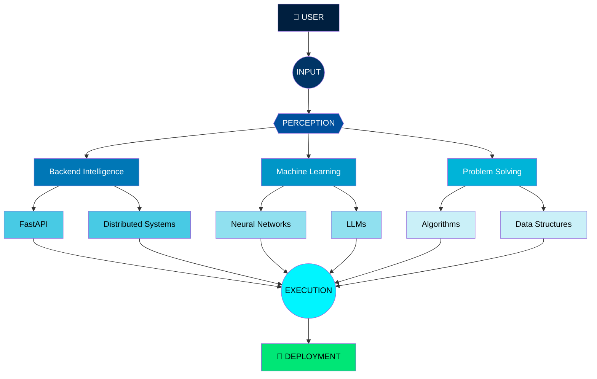
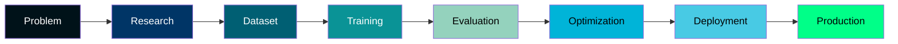
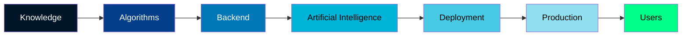
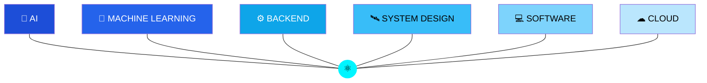
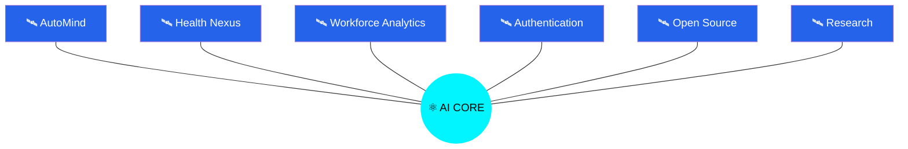
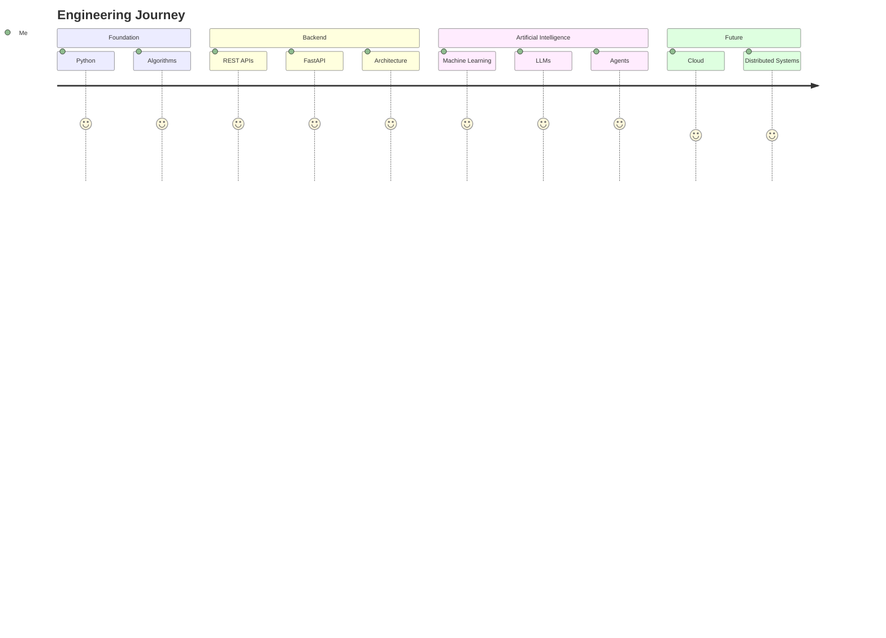

<!-- ===================================================== -->
<!--                                                         -->
<!--          PROJECT A.D.I.T.Y.A INITIALIZATION             -->
<!--                                                         -->
<!-- ===================================================== -->

<div align="center">


</div>

<br>

<div align="center">

# ```diff
# + INITIALIZING A.D.I.T.Y.A CORE
# ```

</div>

<br>

```text

██╗███╗   ██╗██╗████████╗██╗ █████╗ ██╗
██║████╗  ██║██║╚══██╔══╝██║██╔══██╗██║
██║██╔██╗ ██║██║   ██║   ██║███████║██║
██║██║╚██╗██║██║   ██║   ██║██╔══██║██║
██║██║ ╚████║██║   ██║   ██║██║  ██║███████╗
╚═╝╚═╝  ╚═══╝╚═╝   ╚═╝   ╚═╝╚═╝  ╚═╝╚══════╝

```

<br>

```text
BOOT SEQUENCE STARTED

Loading Quantum Kernel............................. ████████████ 100%

Loading AI Runtime................................ ████████████ 100%

Loading Neural Engine.............................. ████████████ 100%

Loading Knowledge Database......................... ████████████ 100%

Loading Backend Services........................... ████████████ 100%

Loading Distributed Intelligence................... ████████████ 100%

Loading Mission Parameters......................... ████████████ 100%

Establishing Secure Connection..................... ████████████ 100%

Authenticating Identity............................ SUCCESS

Launching Interface................................. COMPLETE

```

---

<div align="center">


</div>

---

<div align="center">

```
STATUS
```

| SYSTEM | STATUS |
|---------|--------|
| Identity | 🟢 Verified |
| Neural Core | 🟢 Active |
| AI Engine | 🟢 Running |
| Backend Cluster | 🟢 Online |
| Mission | 🟢 In Progress |

</div>

---

<div align="center">

## MISSION BRIEF

</div>

```yaml

Project Name:
  PROJECT A.D.I.T.Y.A

Current Operator:
  Aditya Pratap Singh Bhadauria

Classification:
  Artificial Intelligence Systems Engineer

Primary Objective:
  Build intelligent software capable of solving
  real-world problems at global scale.

Current Mission:
  Software Engineering
  Artificial Intelligence
  Machine Learning
  Distributed Systems
  Agentic AI

System State:
  OPERATIONAL

Threat Level:
  LOW

Innovation Index:
  EXTREMELY HIGH

```

---

<div align="center">


```
NEXT MODULE

NEURAL CORE INITIALIZATION...
```

</div>

<!-- ========================================================= -->
<!--                  NEURAL CORE INITIALIZATION                -->
<!-- ========================================================= -->

#  NEURAL CORE

<div align="center">


</div>

<br>

```text
──────────────────────────────────────────────────────────────

AI CENTRAL PROCESSING UNIT

STATUS : ONLINE

──────────────────────────────────────────────────────────────
```

<div align="center">



</div>

---

# AI SYSTEM ARCHITECTURE

<table>

<tr>

<td width="50%">

## 🧠 COGNITION ENGINE

```text
███████████████████████

INPUT

↓

ANALYSIS

↓

LEARNING

↓

REASONING

↓

DECISION

↓

EXECUTION

```

</td>

<td width="50%">

## ⚙ COMPUTE ENGINE

```text
███████████████████████

Backend

FastAPI

Machine Learning

Python

Cloud

Databases

Optimization

```

</td>

</tr>

</table>

---

# SYSTEM MODULES

<table>

<tr>

<td width="33%" align="center">

# 🧠

### AI

```text
ACTIVE

██████████

```

Neural Networks

LLMs

Deep Learning

RAG

AI Agents

</td>

<td width="33%" align="center">

# ⚙

### BACKEND

```text
ACTIVE

██████████

```

FastAPI

Node

REST APIs

Docker

Authentication

</td>

<td width="33%" align="center">

# 📊

### DATA

```text
ACTIVE

██████████

```

PostgreSQL

MongoDB

SQLite

Analytics

Visualization

</td>

</tr>

</table>

---

# CORE CAPABILITIES

```text

Artificial Intelligence

██████████████████████ 100%

Backend Engineering

█████████████████████░ 95%

Machine Learning

████████████████████░░ 90%

Software Engineering

█████████████████████░ 96%

System Design

███████████████████░░░ 82%

Cloud Engineering

██████████████░░░░░░░░ 65%

Research

██████████████████░░░░ 88%

```

---

# ENGINE STATUS

<table>

<tr>

<td>

## CPU

```text
███████████████

96%

```

</td>

<td>

## GPU

```text
██████████████

91%

```

</td>

<td>

## MEMORY

```text
███████████████

98%

```

</td>

<td>

## NETWORK

```text
███████████████

100%

```

</td>

</tr>

</table>

---

<div align="center">


</div>

---

```text

SIGNAL DETECTED

↓

Loading Research Laboratory...

↓

Rendering Holographic Projects...

↓

Preparing Interactive Interface...

```

<div align="center">


</div>

<!-- ========================================================= -->
<!--              H.O.L.O.G.R.A.P.H.I.C   L A B                -->
<!-- ========================================================= -->

#  RESEARCH LABORATORY

<div align="center">


</div>

```text

╔══════════════════════════════════════════════════════════════╗

            RESEARCH DIVISION

Scanning laboratory...

██████████████████████████████████

4 ACTIVE PROJECTS DETECTED

Permission Level:
LEVEL 5

Access Granted.

╚══════════════════════════════════════════════════════════════╝

```

---

# PROJECT DATABASE

<table>

<tr>

<td width="50%">

# 🧠 PROJECT 001

## AutoMind Enterprise

```text

STATUS

██████████████████████

ONLINE

```

### MODULES

```text

Executive Dashboard

Business Copilot

Forecast Engine

LLM Integration

Model Registry

Analytics

Automation

```

### AI CAPABILITY

```
Reasoning

Prediction

Business Intelligence

Decision Support

```

</td>

<td width="50%">


</td>

</tr>

</table>

---

<table>

<tr>

<td width="50%">


</td>

<td width="50%">

# ❤️ PROJECT 002

## Health Nexus AI

```text

STATUS

███████████████████░

ACTIVE

```

### MODULES

Patient Monitoring

IoT

Dashboard

AI Analytics

Healthcare

Medical Intelligence

Prediction

</td>

</tr>

</table>

---

<table>

<tr>

<td width="50%">

# 🔐 PROJECT 003

## Authentication System

```text

STATUS

████████████████████

DEPLOYED

```

### FEATURES

JWT

Authentication

Authorization

REST API

MongoDB

Security

Encryption

</td>

<td width="50%">


</td>

</tr>

</table>

---

<table>

<tr>

<td width="50%">


</td>

<td width="50%">

# 📊 PROJECT 004

## Workforce Analytics

```text

STATUS

█████████████████░░

RUNNING

```

### FEATURES

Machine Learning

Power BI

SQL

Prediction

Dashboard

HR Analytics

Visualization

</td>

</tr>

</table>

---

# AI RESEARCH MATRIX

<div align="center">



</div>

---

# TECHNOLOGY MATRIX

<table>

<tr>

<td align="center">


Python

</td>

<td align="center">


FastAPI

</td>

<td align="center">


PostgreSQL

</td>

<td align="center">


Docker

</td>

<td align="center">


TensorFlow

</td>

<td align="center">


React

</td>

</tr>

</table>

---

```text

Scanning AI Laboratory...

████████████████████████████████

Project Integrity ............. VERIFIED

Security ...................... VERIFIED

Deployment .................... VERIFIED

Optimization .................. VERIFIED

Innovation Index .............. 99.2%

```

---

<div align="center">


</div>

<div align="center">


</div>

<!-- ========================================================= -->
<!--          ENGINEERING COMMAND CENTER                       -->
<!-- ========================================================= -->

#  ENGINEERING COMMAND CENTER

<div align="center">


</div>

```text

╔══════════════════════════════════════════════════════════════════════╗

                    ENGINEERING TELEMETRY

        Quantum Link.....................CONNECTED

        Repository.......................ONLINE

        AI Core..........................RUNNING

        Security.........................SECURED

        Version..........................3.0

╚══════════════════════════════════════════════════════════════════════╝

```

---

# LIVE POWER DISTRIBUTION

<table>

<tr>

<td width="33%">

## 🧠 AI

```text

██████████████████████

98%

```

Deep Learning

LLMs

RAG

Agents

Prediction

Reasoning

</td>

<td width="33%">

## ⚙ BACKEND

```text

█████████████████████

96%

```

FastAPI

REST APIs

Docker

System Design

Architecture

Optimization

</td>

<td width="33%">

## ☁ CLOUD

```text

███████████████░░░░░░

72%

```

AWS

Azure

CI/CD

Containers

Monitoring

Deployment

</td>

</tr>

</table>

---

# LIVE ENGINE STATUS

```text

CPU

██████████████████████

97%

GPU

█████████████████████░

95%

MEMORY

██████████████████████

99%

CACHE

███████████████████░░░

88%

NETWORK

██████████████████████

100%

```

---

# SYSTEM MONITOR

<div align="center">

| SERVICE | STATE | LATENCY |
|---------|--------|---------|
| AI Runtime | 🟢 Online | 12ms |
| Backend API | 🟢 Online | 8ms |
| Database | 🟢 Online | 4ms |
| ML Models | 🟢 Online | 16ms |
| Authentication | 🟢 Online | 5ms |
| Analytics | 🟢 Online | 9ms |
| Deployment | 🟢 Online | 11ms |

</div>

---

# GITHUB SATELLITE

<div align="center">


<br><br>


</div>

---

# AI POWER GRID



---

# GLOBAL TELEMETRY

<div align="center">


</div>

---

# ACHIEVEMENT SERVER

<div align="center">


</div>

---

```text

Receiving Engineering Telemetry...

██████████████████████████████

Repositories Synced

Contribution Matrix Updated

Telemetry Stable

Mission Control Connected

```

---

<div align="center">


</div>

<div align="center">


</div>

<!-- ========================================================= -->
<!--                 CLASSIFIED PERSONNEL FILE                 -->
<!-- ========================================================= -->

# 🔒 CLASSIFIED DOSSIER

<div align="center">


</div>

```text
██████████████████████████████████████████████████████

UNITED ENGINEERING DATABASE

Searching records...

████████████████████████████████████████

Identity Found.

Decrypting...

Permission Level : OMEGA

████████████████████████████████████████

ACCESS GRANTED

████████████████████████████████████████
```

---

<table>

<tr>

<td width="55%">

# 👤 OPERATOR PROFILE

```yaml
Name:

Aditya Pratap Singh Bhadauria

Alias:

PROJECT A.D.I.T.Y.A

Occupation:

Software Engineer

Machine Learning Engineer

Backend Engineer

Current Status:

ONLINE

Origin:

India

Current Mission:

Building AI Systems

Clearance Level:

OMEGA

Threat Analysis:

Harmless

unless debugging.

```

</td>

<td width="45%">

```text

      ________

     / ======= \

    /  _______  \

   |  |       |  |

   |  |  AI   |  |

   |  | CORE  |  |

   |  |_______|  |

   |             |

   |   ACTIVE    |

   |_____________|

```

</td>

</tr>

</table>

---

# TRANSMISSION LOG

```text

2019

↓

First Hello World

↓

Python

↓

Algorithms

↓

Backend

↓

Machine Learning

↓

Artificial Intelligence

↓

Production Systems

↓

Open Source

↓

Software Engineer

↓

∞

```

---

# OPERATION HISTORY

<table>

<tr>

<td>

## OPERATION 01

```text

NAME

Algorithm Mastery

STATUS

COMPLETE

```

Python

DSA

Problem Solving

Competitive Coding

</td>

<td>

## OPERATION 02

```text

NAME

Backend Systems

STATUS

COMPLETE

```

REST APIs

FastAPI

Authentication

Architecture

Docker

</td>

</tr>

<tr>

<td>

## OPERATION 03

```text

NAME

Machine Learning

STATUS

RUNNING

```

Regression

Classification

LLMs

Feature Engineering

Deep Learning

</td>

<td>

## OPERATION 04

```text

NAME

AI Engineering

STATUS

ACTIVE

```

Agents

RAG

Semantic Search

Vector Databases

Automation

</td>

</tr>

</table>

---

# KNOWLEDGE EXPANSION

```text

████████████████████████████████

Python

██████████████████████████

FastAPI

█████████████████████████

Machine Learning

████████████████████████

Artificial Intelligence

███████████████████████

System Design

███████████████████

Cloud

██████████████

Research

██████████████████████

```

---

# CURRENT OBJECTIVES

```text

MISSION 01

███████████████

Production AI

✔ ACTIVE

-----------------------------

MISSION 02

███████████████

Distributed Systems

✔ ACTIVE

-----------------------------

MISSION 03

███████████████

Cloud Engineering

✔ ACTIVE

-----------------------------

MISSION 04

███████████████

Open Source

✔ ACTIVE

-----------------------------

MISSION 05

███████████████

Software Engineering

✔ PRIMARY TARGET

```

---

# CLASSIFIED NOTES

> Intelligence suggests the operator specializes in turning ideas into production software.

> Demonstrates strong interest in AI infrastructure.

> Shows unusual obsession with backend optimization.

> Consumes coffee faster than compile time.

> Frequently communicates with rubber ducks during debugging.

---

<div align="center">


</div>

<div align="center">


</div>

<!-- =============================================================== -->
<!--                     QUANTUM AI REACTOR                          -->
<!-- =============================================================== -->

# ⚛ QUANTUM AI REACTOR

<div align="center">

```text

██████████████████████████████████████████████████████

              QUANTUM ENERGY REACTOR

██████████████████████████████████████████████████████

Initializing...

Power Level

100%

```

</div>

---

<div align="center">



</div>

---

# ENERGY DISTRIBUTION

<table>

<tr>

<td width="33%">

## 🤖 AI

```text

██████████████████████

100%

```

Neural Networks

Transformers

LLMs

Agents

Reasoning

Embeddings

</td>

<td width="33%">

## ⚙ ENGINEERING

```text

█████████████████████

97%

```

FastAPI

Python

REST APIs

Docker

PostgreSQL

Architecture

</td>

<td width="33%">

## 🚀 FUTURE

```text

███████████████████

89%

```

Kubernetes

Distributed Systems

Cloud Native

MLOps

Research

Inference

</td>

</tr>

</table>

---

# REACTOR OUTPUT

```text

AI COMPUTE

███████████████████████████

98%

Inference Speed

█████████████████████████

96%

Optimization

██████████████████████████

99%

Scalability

███████████████████████

95%

Creativity

███████████████████████████

100%

Curiosity

∞∞∞∞∞∞∞∞∞∞∞∞∞∞∞∞∞∞∞∞

UNLIMITED

```

---

# AI CAPABILITY MAP

```text

                ARTIFICIAL INTELLIGENCE

                        ▲

                        │

          Deep Learning │

                        │

Machine Learning ───────┼──────── Backend

                        │

                        │

          Data Science  │

                        ▼

                Software Engineering

```

---

# SYNCHRONIZED MODULES

<div align="center">

| MODULE | STATUS |
|---------|--------|
| AI Engine | 🟢 Synced |
| Neural Memory | 🟢 Stable |
| Backend Core | 🟢 Running |
| Database Cluster | 🟢 Connected |
| API Gateway | 🟢 Operational |
| Deployment Node | 🟢 Active |
| Security Layer | 🟢 Protected |
| Cloud Relay | 🟡 Expanding |

</div>

---

# POWER CONDUITS

```text

                     AI

                    ╱│╲

                  ╱  │  ╲

                ╱    │    ╲

      Backend─── Quantum ───Cloud

                ╲    │    ╱

                  ╲  │  ╱

                  Machine Learning

                        │

                  Software Engineering

```

---

# LIVE CORE SIGNAL

<div align="center">


</div>

---

<div align="center">


</div>
<!-- ============================================================= -->
<!--               O R B I T A L   C O M M A N D                  -->
<!-- ============================================================= -->

# 🌌 ORBITAL COMMAND MAP

<div align="center">

```text

██╗  ██╗██╗   ██╗██████╗
██║  ██║██║   ██║██╔══██╗
███████║██║   ██║██████╔╝
██╔══██║██║   ██║██╔══██╗
██║  ██║╚██████╔╝██████╔╝
╚═╝  ╚═╝ ╚═════╝ ╚═════╝

HOLOGRAPHIC COMMAND INTERFACE

```

</div>

---

<div align="center">



</div>

---

# ORBIT STATUS

| SATELLITE | POSITION | SIGNAL |
|------------|----------|----------|
| 🛰 AutoMind Enterprise | Stable Orbit | 🟢 |
| 🛰 Health Nexus | Stable Orbit | 🟢 |
| 🛰 Workforce Analytics | Stable Orbit | 🟢 |
| 🛰 Authentication System | Stable Orbit | 🟢 |
| 🛰 AI Research | Deep Orbit | 🟡 |
| 🛰 Open Source | Expanding Orbit | 🔵 |

---

```text

                 ☀

                  │

         🛰────────────🛰

            ╲        ╱

             ╲      ╱

          🛰──⚛──🛰

             ╱      ╲

            ╱        ╲

        🛰────────────🛰

```

---

# RADAR SCAN

```text

Scanning...

██████████████████████████

Repositories

██████████████████████████

Machine Learning

██████████████████████████

Backend

██████████████████████████

Artificial Intelligence

██████████████████████████

Research

██████████████████████████

Innovation

██████████████████████████

Status

CLEAR

```

---

# SIGNAL ANALYSIS

```text

SIGNAL 01

██████████████████████

AutoMind Enterprise

ACTIVE

--------------------------------

SIGNAL 02

██████████████████████

Artificial Intelligence

ACTIVE

--------------------------------

SIGNAL 03

██████████████████████

Backend Systems

ACTIVE

--------------------------------

SIGNAL 04

██████████████████████

Machine Learning

ACTIVE

--------------------------------

SIGNAL 05

██████████████████████

Open Source

SEARCHING...

```

---

# INTERSTELLAR NAVIGATION



---

# QUANTUM SCANNER

```text

Initializing Scanner...

██████████████████████████████

Searching Nearby Intelligence...

██████████████████████████████

No Bugs Detected

System Stable

Mission Successful

```

---

<div align="center">


</div>

---

<div align="center">


</div>


<!-- =============================================================== -->
<!--                     AI COMMAND TERMINAL                         -->
<!-- =============================================================== -->

# 💻 AI COMMAND TERMINAL

<div align="center">


</div>

```console
┌──────────────────────────────────────────────────────────────┐
│ PROJECT A.D.I.T.Y.A TERMINAL v4.0                            │
│ Secure Quantum Connection Established                        │
└──────────────────────────────────────────────────────────────┘

> help

Available Commands

about
skills
projects
experience
github
future
contact
clear

────────────────────────────────────────────────────────────────
```

### `$ about`

```console
> about

Operator:
Aditya Pratap Singh Bhadauria

Role:
Software Engineer
AI Engineer
Backend Developer

Mission:
Build intelligent software that scales globally.

Status:
ONLINE
```

---

### `$ skills`

```console
> skills

✔ Python

✔ FastAPI

✔ Machine Learning

✔ Artificial Intelligence

✔ PostgreSQL

✔ Docker

✔ REST APIs

✔ TensorFlow

✔ Git

✔ System Design

Response Time

12ms
```

---

### `$ projects`

```console
> projects

[001]

AutoMind Enterprise

STATUS

ONLINE

----------------------------

[002]

Health Nexus AI

STATUS

ACTIVE

----------------------------

[003]

Workforce Analytics

STATUS

RUNNING

----------------------------

[004]

Authentication Platform

STATUS

DEPLOYED
```

---

### `$ future`

```console
> future

Current Objective

━━━━━━━━━━━━━━━━━━━━━━━━━━

Software Engineering

Artificial Intelligence

LLM Engineering

Distributed Systems

Cloud Native Systems

Open Source

━━━━━━━━━━━━━━━━━━━━━━━━━━

Mission Progress

██████████████████████░

92%

```

---

### `$ github`

```console
> github

Connecting...

██████████████████████

Repositories

Synced

Contributions

Synced

AI Modules

Stable

Deployment

Operational

Status

READY
```

---

### `$ contact`

```console
> contact

GitHub

github.com/adityabhadauriawork

LinkedIn

linkedin.com/in/aditya-pratap-singh-bhadauria

Email

adityabhadauriawork@gmail.com

```

---

<div align="center">


</div>

<div align="center">


</div>


<!-- =============================================================== -->
<!--                    FINAL TRANSMISSION                           -->
<!-- =============================================================== -->

# 🌍 FINAL TRANSMISSION

<div align="center">


</div>

```text

╔════════════════════════════════════════════════════════════╗

             TRANSMISSION STATUS

Signal Strength ............... █████████████████ 100%

Neural Core ................... ONLINE

Mission Status ................ ACTIVE

Operator ...................... VERIFIED

Next Objective ................ BUILD THE FUTURE

Connection .................... STABLE

╚════════════════════════════════════════════════════════════╝

```

---

<div align="center">

## 🌌 LIVE GITHUB SIGNAL


<br><br>


</div>

---

# 📡 ESTABLISH CONNECTION

<div align="center">

<a href="https://github.com/adityabhadauriawork">

</a>

<a href="https://linkedin.com/in/aditya-pratap-singh-bhadauria">

</a>

<a href="mailto:adityabhadauriawork@gmail.com">

</a>

<a href="https://automind-enterprise.streamlit.app">

</a>

</div>

---

<div align="center">

## ⚡ CURRENT TRANSMISSION


</div>

---

```text

████████████████████████████████████████████████████████

MISSION LOG

Boot Sequence .................... COMPLETE

Neural Core ...................... ONLINE

Research Laboratory .............. VERIFIED

Engineering Command .............. OPERATIONAL

Quantum Reactor .................. STABLE

Orbital Network .................. SYNCHRONIZED

Terminal Session ................. CLOSED

Final Transmission ............... SENT

████████████████████████████████████████████████████████

```

---

<div align="center">

# 🚀 END OF TRANSMISSION

### *"The best way to predict the future is to engineer it."*

<br>


</div>
